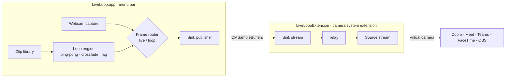

<div align="center">


# LiveLoop

**Step away, stay on camera.**

Loop a short clip of yourself through a virtual camera so you look present on any
video call while you grab a coffee, rest your eyes, or answer the door — your
audio keeps passing straight through.

A free, open-source, native macOS take on the CamLoop idea, with every "Pro"
feature unlocked.


</div>

---

## What it does

LiveLoop lives in your menu bar and registers a **virtual camera** that Zoom,
Google Meet, Microsoft Teams, Slack, FaceTime, OBS — anything with a camera
picker — can select. Record a few seconds of yourself, pick **LiveLoop** as your
camera, and one shortcut swaps your live feed for a seamless loop and back.

- 🎥 **Virtual camera** — appears as “LiveLoop” in every app’s camera menu.
- 🔊 **Audio always passes through** — LiveLoop only touches video, so you can
  keep talking or mute as normal. Nothing to configure.
- 🔁 **Seamless loop** — plays forward-then-backward (ping-pong) with a crossfade,
  so there is no visible cut.
- ⌨️ **Global shortcut** — flip live ⇄ loop system-wide without leaving your
  meeting window.
- 📶 **Simulated lag** — optional, never-repeating micro-freezes so the loop reads
  like a flaky connection rather than a frozen app.
- 🗂️ **Unlimited clips** — record, import, export, rename, pin. No length caps.
- 🔒 **Private** — clips never leave your Mac. No account, no network, no telemetry.

### Every CamLoop “Pro” feature, free

| Feature | CamLoop Free | CamLoop Pro | **LiveLoop** |
| --- | :---: | :---: | :---: |
| Virtual camera + audio passthrough | ✅ | ✅ | ✅ |
| Saved clips | 1 | Unlimited | **Unlimited** |
| Clip length | 10 s | Unlimited | **Unlimited** |
| Global hotkeys | — | ✅ | **✅** |
| Simulated lag | — | ✅ | **✅** |
| Seamless ping-pong + crossfade | — | ✅ | **✅** |
| Import / export clips | — | ✅ | **✅** |
| Pin clips | — | ✅ | **✅** |
| Custom camera name | — | ✅ | **✅** |
| Price | Free | $4.99/mo · $49 | **Free & open source** |

---

## Install

Grab `LiveLoop-x.y.z.dmg` from [Releases](../../releases), open it, and drag
**LiveLoop** to Applications.

> [!IMPORTANT]
> **macOS only activates a virtual-camera *system extension* that it trusts.**
> How you sign LiveLoop decides whether it can turn on. Pick one:

### Option A — Signed & notarized (recommended, no system changes)

Build (or download) a LiveLoop signed with a **Developer ID** certificate and
**notarized** by Apple. It then installs and activates on any Mac with System
Integrity Protection **on**, exactly like any other app. This is the path for
sharing LiveLoop with other people. See
[Signing & notarization](#signing--notarization).

### Option B — Self-signed, for your own Mac

A self-signed / personal-team build is blocked by macOS unless you allow
developer system extensions, which requires turning SIP off once:

1. Reboot into **Recovery** (hold the power button on Apple Silicon), open
   **Terminal**, and run:
   ```
   csrutil disable
   ```
2. Reboot, then in a normal Terminal:
   ```
   systemextensionsctl developer on
   ```
3. Open LiveLoop → **Set up LiveLoop** → **Install Camera**, and approve it in
   **System Settings ▸ General ▸ Login Items & Extensions ▸ Camera Extensions**.

> Prefer to keep SIP on? Use Option A. LiveLoop is built so the only difference is
> the certificate it’s signed with — the code is identical.

Once the camera is installed: open your meeting app, choose **LiveLoop** as the
camera, click **Start Camera** in the menu bar, and use the shortcut
(default `⌥⌘L`) to step away.

---

## How it works

LiveLoop is two pieces that talk over Core Media I/O:



- The **app** captures your webcam, records/loops clips, and decides — per frame —
  whether to send the live feed or the loop. It pushes finished 1080p frames into
  the extension’s **sink** stream.
- The **extension** is a deliberately thin, always-stable relay: whatever arrives
  on the sink it forwards to the **source** stream that meeting apps read. When
  the app isn’t running it shows a friendly placeholder card.
- The **loop** plays forward then backward so its ends meet, and a short crossfade
  smooths the live ⇄ loop switch. **Simulated lag** is a seeded, deterministic
  scheduler that occasionally holds a frame — irregular to the eye, reproducible
  in tests.
- **Audio** is never involved: LiveLoop provides a camera only, so your real
  microphone reaches the meeting untouched.

Design notes live in [`docs/DESIGN.md`](docs/DESIGN.md).

---

## Build from source

Requirements: macOS 14+, Xcode 16+, and [XcodeGen](https://github.com/yonsm/XcodeGen)
+ [create-dmg](https://github.com/create-dmg/create-dmg) (`brew install xcodegen create-dmg`).

```bash
git clone https://github.com/adrbn/liveloop.git
cd liveloop

# Generate the Xcode project (project.yml is the source of truth)
xcodegen generate

# Build + sign with your Apple team, then package a DMG
LIVELOOP_SIGN_ID="Apple Development: you@example.com (XXXXXXXXXX)" ./scripts/build.sh
./scripts/make_dmg.sh          # -> dist/LiveLoop-x.y.z.dmg

# Run the tests
xcodebuild -scheme LiveLoop -configuration Debug test -only-testing:LiveLoopTests
```

`scripts/build.sh` auto-detects your certificate’s team and stamps the extension’s
Mach service name accordingly, so you only need to point `LIVELOOP_SIGN_ID` at one
of your identities (`security find-identity -p codesigning -v` lists them).

The app icon is generated from code: `python3 scripts/make_icon.py <out-dir>`.

### Signing & notarization

For a build that runs on other people’s Macs (SIP on):

1. A paid **Apple Developer Program** membership.
2. Enable the **System Extension** capability on the `com.adrbn.LiveLoop` App ID.
3. Sign with **Developer ID Application** and staple a notarization ticket:
   ```bash
   xcrun notarytool submit dist/LiveLoop-x.y.z.dmg --keychain-profile "AC" --wait
   xcrun stapler staple dist/LiveLoop-x.y.z.dmg
   ```

---

## Project layout

```
LiveLoop/                 Menu-bar app
  App/                    Entry point + AppState coordinator
  Camera/                 AVCaptureSession + live/loop frame router
  Loop/                   Ping-pong, lag scheduler, clip frame store, loop engine
  Recording/              AVAssetWriter clip recorder
  Library/                Clip model + library (CRUD, import/export, pin)
  VirtualCamera/          System-extension lifecycle + CMIO sink publisher
  Hotkeys/                Global hotkey (Carbon)
  Settings/ UI/ Shared/   Preferences, SwiftUI views, image pipeline
LiveLoopExtension/        CMIO camera system extension (source + sink relay)
Tests/LiveLoopTests/      Loop-engine + library unit tests
scripts/                  build.sh · make_dmg.sh · make_icon.py
```

---

## Roadmap

- [ ] **AI frame morphing** — optical-flow / learned interpolation (RIFE/FILM in
  Core ML) for a perfectly seamless single-direction loop. Today’s ping-pong +
  crossfade already reads as seamless for the low-motion clips this is built for.
- [ ] Per-clip loop settings (speed, lag profile).
- [ ] Auto-frame alignment to your current pose before looping.
- [ ] Notarized Developer ID release + Sparkle auto-updates.

---

## Why

Because looking present while you refill your coffee shouldn’t cost $49, and
because a virtual camera you run yourself should be something you can read the
source of.

## License

[MIT](LICENSE) © 2026 Adrien Bianca. Not affiliated with CamLoop.
