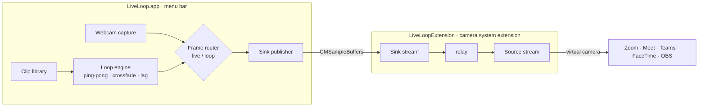

<div align="center">


# LiveLoop

**Step away, stay on camera.**

Loop a short clip of yourself through a virtual camera so you look present on any
video call while you grab a coffee, rest your eyes, or answer the door — your
audio keeps passing straight through.

A free, open-source, native macOS take on the CamLoop idea, with every "Pro"
feature unlocked.


</div>

---

## What it does

LiveLoop lives in your menu bar and registers a **virtual camera** that Zoom,
Google Meet, Microsoft Teams, Slack, FaceTime, OBS — anything with a camera
picker — can select. Record a few seconds of yourself, pick **LiveLoop** as your
camera, and one shortcut swaps your live feed for a seamless loop and back.

- 🎥 **Virtual camera** — appears as “LiveLoop” in every app’s camera menu.
- 🔊 **Audio always passes through** — LiveLoop only touches video, so you can
  keep talking or mute as normal. Nothing to configure.
- 🔁 **Seamless loop** — plays forward-then-backward (ping-pong) with a crossfade,
  so there is no visible cut.
- ⌨️ **Global shortcut** — flip live ⇄ loop system-wide without leaving your
  meeting window.
- 📶 **Simulated lag** — optional, never-repeating micro-freezes so the loop reads
  like a flaky connection rather than a frozen app.
- 🪞 **Live preview** — see exactly what viewers see, with a self-view of your real
  camera in the corner while the loop plays.
- 🗂️ **Unlimited clips** — record, import, export, rename (inline), pin, ⌫ to delete.
  No length caps.
- 🔒 **Private** — clips never leave your Mac. No account, no network, no telemetry.

### Every CamLoop “Pro” feature, free

| Feature | CamLoop Free | CamLoop Pro | **LiveLoop** |
| --- | :---: | :---: | :---: |
| Virtual camera + audio passthrough | ✅ | ✅ | ✅ |
| Saved clips | 1 | Unlimited | **Unlimited** |
| Clip length | 10 s | Unlimited | **Unlimited** |
| Global hotkeys | — | ✅ | **✅** |
| Simulated lag | — | ✅ | **✅** |
| Seamless ping-pong + crossfade | — | ✅ | **✅** |
| Import / export clips | — | ✅ | **✅** |
| Pin clips | — | ✅ | **✅** |
| Custom camera name | — | ✅ | **✅** |
| Price | Free | $4.99/mo · $49 | **Free & open source** |

---

## Install

The release build is **signed with a Developer ID and notarized by Apple**, so it
installs and activates on any Mac with System Integrity Protection **on** — no
developer account, no disabling SIP, nothing to configure.

1. Download **`LiveLoop-x.y.z.dmg`** from [Releases](../../releases).
2. Open it and drag **LiveLoop** to Applications.
3. Launch LiveLoop → click the **Set up LiveLoop** banner → **Install Camera**.
4. Approve the extension once in **System Settings ▸ General ▸ Login Items &
   Extensions ▸ Camera Extensions** (macOS asks with Touch ID).
5. In any meeting app, pick **LiveLoop** as your camera. **Click the preview** to
   start, **Record** a clip, then **Switch to Loop** (or press `⌥⌘L`) and step away.

> [!TIP]
> Chromium browsers (Chrome, Brave) cache the camera list when they launch — if
> LiveLoop doesn't appear, **fully quit** the browser (`⌘Q`) and reopen it once.

Your audio is never touched: LiveLoop provides a camera only, so your real
microphone reaches the meeting untouched.

---

## How it works

LiveLoop is two pieces that talk over Core Media I/O:



- The **app** captures your webcam, records/loops clips, and decides — per frame —
  whether to send the live feed or the loop. It pushes finished 1080p frames into
  the extension’s **sink** stream.
- The **extension** is a deliberately thin, always-stable relay: whatever arrives
  on the sink it forwards to the **source** stream that meeting apps read. When
  the app isn’t running it shows a friendly placeholder card.
- The **loop** plays forward then backward so its ends meet, and a short crossfade
  smooths the live ⇄ loop switch. **Simulated lag** is a seeded, deterministic
  scheduler that occasionally holds a frame — irregular to the eye, reproducible
  in tests.
- **Audio** is never involved: LiveLoop provides a camera only, so your real
  microphone reaches the meeting untouched.

Design notes live in [`docs/DESIGN.md`](docs/DESIGN.md).

---

## Build from source

Requirements: macOS 14+, Xcode 16+, [XcodeGen](https://github.com/yonsm/XcodeGen)
+ [create-dmg](https://github.com/create-dmg/create-dmg) (`brew install xcodegen create-dmg`).

> [!NOTE]
> A **paid Apple Developer Program** membership is required to *build* a working
> build, because a camera **system extension** needs the System Extension
> capability, which free/personal Apple teams cannot provision. (Downloading the
> notarized DMG from Releases needs nothing — that's only for building yourself.)

```bash
git clone https://github.com/adrbn/liveloop.git
cd liveloop
xcodegen generate     # project.yml is the source of truth

# Run the tests (no signing needed)
xcodebuild -scheme LiveLoop -configuration Debug test -only-testing:LiveLoopTests
```

**Notarized release** (installs on any Mac, SIP on) — set your team in
`project.yml` / `ExportOptions.plist`, store notarization credentials once
(`xcrun notarytool store-credentials "LiveLoop" --apple-id you@example.com --team-id XXXXXXXXXX`),
then:

```bash
./scripts/release.sh   # archive → Developer ID export → notarize → staple → DMG
```

**Quick dev build** (for iterating locally; needs `csrutil disable` +
`systemextensionsctl developer on`): `./scripts/build.sh`.

The app icon is generated from code: `python3 scripts/make_icon.py <out-dir>`.

---

## Project layout

```
LiveLoop/                 Menu-bar app
  App/                    Entry point + AppState coordinator
  Camera/                 AVCaptureSession + live/loop frame router
  Loop/                   Ping-pong, lag scheduler, clip frame store, loop engine
  Recording/              AVAssetWriter clip recorder
  Library/                Clip model + library (CRUD, import/export, pin)
  VirtualCamera/          System-extension lifecycle + CMIO sink publisher
  Hotkeys/                Global hotkey (Carbon)
  Settings/ UI/ Shared/   Preferences, SwiftUI views, image pipeline
LiveLoopExtension/        CMIO camera system extension (source + sink relay)
Tests/LiveLoopTests/      Loop-engine + library unit tests
scripts/                  build.sh · make_dmg.sh · make_icon.py
```

---

## Roadmap

- [ ] **AI frame morphing** — optical-flow / learned interpolation (RIFE/FILM in
  Core ML) for a perfectly seamless single-direction loop. Today’s ping-pong +
  crossfade already reads as seamless for the low-motion clips this is built for.
- [ ] Per-clip loop settings (speed, lag profile).
- [ ] Auto-frame alignment to your current pose before looping.
- [ ] Notarized Developer ID release + Sparkle auto-updates.

---

## Why

Because looking present while you refill your coffee shouldn’t cost $49, and
because a virtual camera you run yourself should be something you can read the
source of.

## License

[MIT](LICENSE) © 2026 Adrien Bianca. Not affiliated with CamLoop.
