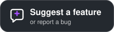

<p align="center">
  
</p>

<h1 align="center">LiveLoop</h1>

<p align="center">
  <b>Loop yourself in.</b><br>
  Loop a few seconds of yourself on any video call while you grab a coffee —<br>
  one shortcut out, one shortcut back. Free, open source, native to macOS.
</p>

<p align="center">
  <a href="https://github.com/adrbn/liveloop/releases/latest"></a>
  &nbsp;
  <a href="https://ko-fi.com/adrbn"></a>
  &nbsp;
  <a href="https://github.com/adrbn/liveloop/issues/new"></a>
</p>

<p align="center">
  <a href="https://github.com/adrbn/liveloop/releases/latest"></a>
  
  
  <a href="./LICENSE"></a>
</p>

https://github.com/user-attachments/assets/1038b4cf-f2fe-4d04-b8ec-d606f18a1b70

<p align="center">
  <sub>Demo reconstructed: the webcam footage is AI-generated (Google Veo); the other participants are stock footage from Pexels.</sub>
</p>

<p align="center">
  <a href="#get-started">Get started</a> ·
  <a href="#features">Features</a> ·
  <a href="#beta-features">Beta</a> ·
  <a href="#faq">FAQ</a> ·
  <a href="#support-liveloop">Support</a>
</p>

---

## Why LiveLoop

- 🔁 **It looks like you, not a frozen frame.** The clip plays forward then backward, so it never jumps, and a short crossfade hides the switch. Turn on *simulated lag* and the odd stutter makes it read like a shaky connection instead.
- ⌨️ **One shortcut, from inside your meeting.** `⌥⌘L` works system-wide, so you never have to leave the call window to step away or come back.
- 🔊 **Your audio is untouched.** LiveLoop only provides a camera; your meeting app keeps your mic, so you can still talk, mute and unmute as usual.
- 🎥 **Works where your camera works.** Zoom, Google Meet, Microsoft Teams, Slack, FaceTime, OBS: anything with a camera picker.
- 🔒 **Nothing leaves your Mac.** No account, no network access, no telemetry. Your real webcam switches on when a call starts using LiveLoop, and off again when it ends.
- 💸 **Free, with no paid tier.** Unlimited clips, custom shortcut, simulated lag, import and export. No trial, no subscription, and the code is open source (GPL-3.0).

## Get started

1. **[Download LiveLoop](https://github.com/adrbn/liveloop/releases/latest)**, open the `.dmg` and drag LiveLoop to Applications.
2. **Launch it** → **Set up LiveLoop** → **Install Camera**, and approve when macOS asks.
3. **Pick "LiveLoop" as your camera** in Zoom, Meet, Teams, FaceTime…
4. Click **Record** in the menu-bar panel and film a few seconds of yourself looking at the screen. The camera doesn't need to be on.
5. Press **`⌥⌘L`** (or click **Switch to Loop**) and step away. Press it again when you're back.

> [!TIP]
> **Record like you're listening.** 5–10 seconds, looking at the screen, small natural movements (a nod, a blink) and no big gestures. A calm clip loops invisibly.

> [!NOTE]
> **Meeting in Chrome or Brave?** Quit the browser completely (`⌘Q`) and reopen it once after installing. Browsers only read the camera list at launch.

## Features

| Feature | What it does |
| --- | --- |
| **Seamless loop** | Forward-then-backward playback with a crossfade on every switch. No visible cut |
| **Simulated lag** | Irregular micro-freezes that never repeat, with an adjustable intensity |
| **Global shortcut** | `⌥⌘L` by default; pick another combination in Settings if it clashes |
| **Live preview** | Shows exactly what others see, plus a small view of your real camera while the loop plays |
| **Picture quality** | Full 1080p, or a softer 720p that makes the loop even harder to spot |
| **Clip library** | Unlimited clips. Record 1–30 s or import any `.mov` / `.mp4`. Rename, pin, export |
| **Keyboard-friendly** | `↑` `↓` to switch clips, `⌫` to delete, `⌘Z` to undo |
| **Your camera name** | Rename the virtual camera to whatever you want it to show up as in the camera menu |
| **Menu-bar app** | Lives next to the clock: no Dock icon, no window in your way |

## Beta features

New and still being polished. Each one is **off until you switch it on**, and all of them run on your Mac. They live in **Settings ▸ Beta**, except the connection styles, which are part of Simulated lag.

| Beta | What it does |
| --- | --- |
| **Smart switch** | Starts the loop on the frame that looks most like you right now, and waits up to 2 s for the loop to line up with you before going live. No jump either way |
| **Auto away** | Nobody at the desk for a few seconds? It switches to the loop on its own, and goes live again when you sit back down. Face detection runs on-device |
| **Name alert** | While you're on the loop, a chime and a notification when someone says your name. Listens to the meeting audio (works with headphones) or your mic. Speech is transcribed on your Mac only |
| **Connection styles** | Three more styles for Simulated lag (**Settings ▸ Loop**): *Shaky Wi-Fi*, *4G on the go* or *Dropping out*, with realistic freezes and blocky patches instead of the plain stutter |
| **Loop timer** | How long you've been away, right next to the menu-bar icon, plus an optional "Still away?" reminder |
| **Automations** | Shortcuts actions and `liveloop://` links for Stream Deck, Raycast, Alfred or your own scripts |

<details>
<summary><b>Automation links</b></summary>

| Link | What it does |
| --- | --- |
| `liveloop://toggle` | Same as the shortcut |
| `liveloop://loop` | Switch to the loop (turns the camera on if needed) |
| `liveloop://live` | Back to live |
| `liveloop://start` · `liveloop://stop` | Camera on · off |
| `liveloop://clip?name=Coffee` | Select a clip by name |

Try it from Terminal with `open "liveloop://toggle"`. In the Shortcuts app, search for **LiveLoop**.
</details>

## FAQ

<details>
<summary><b>Which apps does it work with?</b></summary>

Anything that lets you choose a camera: Zoom, Google Meet, Microsoft Teams, Slack, FaceTime, OBS, Photo Booth, and meetings in the browser (Chrome, Brave…).

**Not yet:** WhatsApp Desktop doesn't list virtual cameras. I'm looking into it.
</details>

<details>
<summary><b>LiveLoop doesn't show up in my camera list</b></summary>

1. Quit the meeting app completely (`⌘Q`) and reopen it. Most apps only read the camera list at launch.
2. Check that the camera is approved in **System Settings ▸ General ▸ Login Items & Extensions ▸ Camera Extensions**, and that **LiveLoop** is switched on there.
3. Still nothing? [Open an issue](https://github.com/adrbn/liveloop/issues/new) with your macOS version and the app you're using.
</details>

<details>
<summary><b>Why does macOS ask me to approve a "system extension"?</b></summary>

That's how every virtual camera works on modern macOS; OBS's goes through the same approval. The extension does one thing: it passes along the frames the LiveLoop app sends it. It's signed and notarized by Apple, and you can remove it at any time (see below).
</details>

<details>
<summary><b>Does LiveLoop record my audio or send anything anywhere?</b></summary>

No. LiveLoop has no network code at all: no analytics, no update pings, no account. Your clips stay on your Mac and nowhere else.

It never listens to audio either, unless you switch on the beta **Name alert**. Even then it only listens while you're on the loop, and speech recognition is forced to run on your Mac: nothing is recorded, and nothing is sent anywhere. The whole source is right here if you want to check.
</details>

<details>
<summary><b>What do people see if LiveLoop isn't running?</b></summary>

A plain card that reads **LiveLoop · Open the app to go live** instead of your face, so keep LiveLoop running during calls where you use it. Reopen it and start the camera to go live again.
</details>

<details>
<summary><b>How do I uninstall it?</b></summary>

LiveLoop ▸ Settings ▸ **Virtual Camera** ▸ **Remove**, then drag LiveLoop from Applications to the Trash.
</details>

## What's next

- **AI frame morphing.** Learned frame interpolation for a perfect one-way loop. (Pose-matched switching is already in beta.)
- **Per-clip settings** for speed and lag.
- **In-app updates**, so you never have to download a new version by hand again.

Have an idea or found a bug? [Open an issue](https://github.com/adrbn/liveloop/issues). Every report gets read.

## Support LiveLoop

LiveLoop is free and will stay free. If it covered for you on a coffee break, you can **[buy me a coffee on Ko-fi](https://ko-fi.com/adrbn)** ☕. A ⭐ on the repo helps other people find it too.

<details>
<summary><b>Build it from source</b></summary>

Requires macOS 14+, Xcode 16+, [XcodeGen](https://github.com/yonaskolb/XcodeGen) and [create-dmg](https://github.com/create-dmg/create-dmg) (`brew install xcodegen create-dmg`).

```bash
git clone https://github.com/adrbn/liveloop.git && cd liveloop
xcodegen generate   # project.yml is the source of truth
xcodebuild -scheme LiveLoop -configuration Debug test -only-testing:LiveLoopTests CODE_SIGNING_ALLOWED=NO
```

The tests need no signing. A **working build** does: a camera system extension needs the System Extension capability, which only a **paid Apple Developer Program** team can provision, and it must be notarized to load on macOS 14+. Set your team in `project.yml` and `ExportOptions.plist`, sign in to Xcode ▸ Settings ▸ Accounts with it, store notarization credentials once with `xcrun notarytool store-credentials "LiveLoop"`, then:

```bash
./scripts/release.sh   # tests → archive → Developer ID export → notarize → staple → DMG
```

How the app and the camera extension fit together, and why, is in [`docs/DESIGN.md`](docs/DESIGN.md).
</details>

## License

[GPL-3.0](LICENSE) © 2026 adrbn. You can use, study, change and share LiveLoop, but anything you distribute that is built on it must stay open source under the same license.
